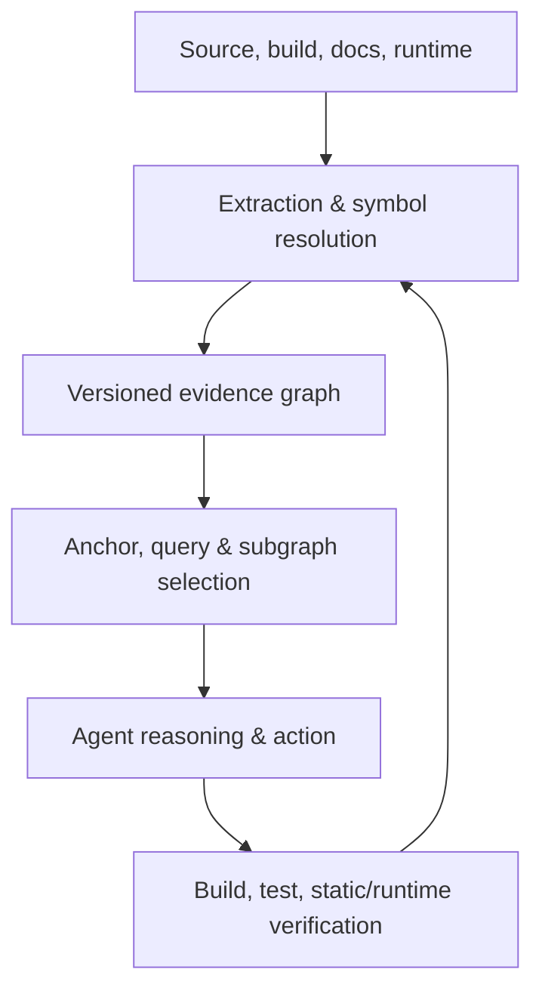
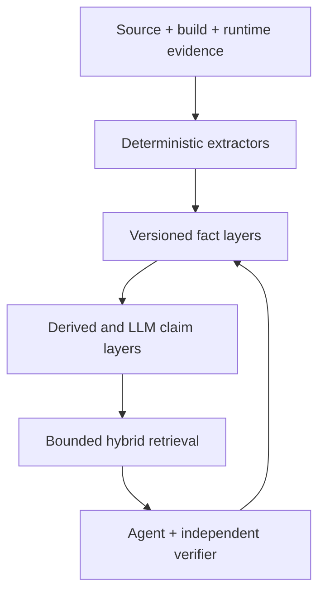
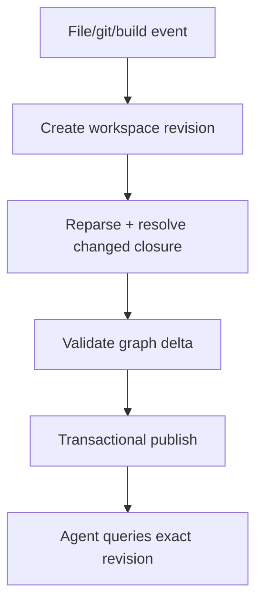

# Limitations và pain points của Code Knowledge Graph hiện tại — nguyên nhân, tác động và hướng giải quyết

**Phụ lục độc lập cho báo cáo tổng quan Code-Knowledge-Graph**  
**Mốc rà soát:** 04-08-2026  
**Phạm vi:** graph biểu diễn mã nguồn/repository được dùng cho code understanding, localization, repair, generation, security analysis và coding agents; ưu tiên công trình 2025–2026, nhưng dùng một số công trình nền để giải thích nguồn gốc vấn đề.

---

## 0. Cách đọc và giới hạn của báo cáo này

Báo cáo tách ba đối tượng thường bị đánh đồng:

1. **Chất lượng của graph artifact:** node/edge có đúng, đủ, có nguồn gốc và khớp revision hay không.
2. **Chất lượng của lớp tiêu thụ graph:** agent có chọn đúng anchor, traversal, subgraph và context hay không.
3. **Chất lượng downstream:** agent có trả lời đúng, tạo patch đúng, không gây regression và hoàn thành task hay không.

Một graph có edge chính xác vẫn có thể bị query sai; một subgraph retrieval đúng vẫn có thể dẫn tới patch sai; ngược lại, một patch có thể pass test dù graph thiếu hoặc sai nhờ LLM đoán đúng. Vì vậy, báo cáo **không suy luận chất lượng graph chỉ từ resolve rate**.

Các nhãn bằng chứng dùng xuyên suốt:

- **[D] Direct:** limitation/risk được chính tác giả nêu trong paper.
- **[E] Empirical:** failure, ablation hoặc số liệu thí nghiệm trực tiếp cho thấy vấn đề.
- **[S] Synthesis:** kết luận tổng hợp từ nhiều nguồn; đây là phân tích của báo cáo, không phải nguyên văn claim của một paper.
- **[P] Preprint:** bằng chứng mới nhưng chưa qua phản biện tại thời điểm rà soát; cần replication.

“Giải pháp” trong tài liệu là kiến trúc đề xuất dựa trên tổng hợp bằng chứng. Không có một paper đơn lẻ nào đã chứng minh toàn bộ stack này.

---

## 1. Kết luận điều hành

### 1.1 Mười kết luận quan trọng nhất

1. **Phần lớn “code knowledge graph” 2025–2026 thực chất là một chỉ mục cấu trúc có kiểu, không phải nguồn chân lý đầy đủ về hành vi chương trình.** RepoGraph, LocAgent và RepoDistill chủ yếu dùng các quan hệ như containment, invocation, import hoặc inheritance. Chúng rất hữu ích cho navigation nhưng không tự giải quyết aliasing, overload, dynamic dispatch, reflection, dependency injection hay runtime configuration.

2. **Tree-sitter/AST cho độ bao phủ cú pháp và tính xác định tốt, nhưng cú pháp không đồng nghĩa semantic binding.** Một identifier giống tên callee không đủ chứng minh nó trỏ đến symbol nào. Công trình so sánh AST-derived graph với LLM-extracted graph năm 2026 cũng thừa nhận AST bỏ sót reflection, runtime-generated code và dynamic dispatch ([Reliable Graph-RAG](https://arxiv.org/abs/2601.08773), [D][P]).

3. **Dùng LLM để tạo fact graph trực tiếp làm đổi loại lỗi, không xóa lỗi.** LLM có thể bổ sung semantic intent mà parser không thấy, nhưng graph trở nên stochastic, có thể bỏ file, vi phạm schema hoặc hallucinate edge. Trong [Reliable Graph-RAG](https://arxiv.org/abs/2601.08773), LLM-KB chỉ tạo record thành công cho 833/1.210 file trên Shopizer và có chi phí tăng mạnh theo repository ([E][P]).

4. **Graph snapshot nhanh chóng trở thành graph sai nếu không gắn revision và cập nhật incremental.** Edit chưa commit, branch switch, rebase, rename, generated files và thay đổi dependency đều có thể khiến agent nhận câu trả lời đúng đối với một phiên bản cũ nhưng sai đối với workspace hiện tại.

5. **Nhiều edge hơn không mặc nhiên tốt hơn.** Graph quá thưa bỏ mất evidence; graph quá giàu tạo high-degree hubs, traversal explosion, storage/index cost và context noise. [RepoDistill](https://aclanthology.org/2026.findings-acl.217/) cho thấy ngay cả context được GraphRAG truy hồi vẫn chứa nhiều nhánh không liên quan, và hiệu năng giảm khi context tăng quá dài ([E]).

6. **Nút thắt thường chuyển từ retrieval sang reasoning.** [RepoGraph](https://proceedings.iclr.cc/paper_files/paper/2025/file/4a4a3c197deac042461c677219efd36c-Paper-Conference.pdf) ghi nhận contextual misalignment và regressive fixes sau localization; [Code Graph Model](https://proceedings.neurips.cc/paper_files/paper/2025/file/178ae4ba29022eb7bf509c2e27bc8ab8-Paper-Conference.pdf) cho biết khoảng 80% failure được kiểm tra là code chạy được nhưng không giải quyết issue ([E]). Graph giúp tìm, không thay thế semantic reasoning và validation.

7. **LLM tự sinh Cypher/graph query là một interface mạnh nhưng giòn.** [CodexGraph](https://aclanthology.org/2025.naacl-long.7/) ghi nhận missing edges làm query thất bại và tìm kiếm sâu khó hơn; hiệu quả còn phụ thuộc năng lực query reasoning/coding của LLM ([D][E]). Production nên ưu tiên tool có kiểu và query plan bị giới hạn, giữ raw query làm fallback read-only.

8. **Benchmark hiện tại chưa đủ để khẳng định graph “đúng”.** Nhiều paper chỉ đo localization/resolve/generation, ít đo node/edge precision-recall, binding accuracy, stale-edge rate hoặc provenance coverage. SWE-bench patch location cũng chỉ là ground truth xấp xỉ vì có thể tồn tại nhiều sửa chữa hợp lệ ([LocAgent](https://aclanthology.org/2025.acl-long.426.pdf), [D]).

9. **Graph trở thành một security authority mới.** [Oracle Poisoning](https://arxiv.org/abs/2605.09822) cho thấy agent có thể suy luận hoàn toàn hợp lý trên node/edge đã bị sửa và đi đến kết luận sai; tăng cường system prompt không có tác dụng đo được trong thí nghiệm đó ([E][P]). Read-only access, provenance, audit và cross-verification là yêu cầu nền tảng.

10. **Kiến trúc có triển vọng nhất là “versioned evidence graph”, không phải một graph phẳng duy nhất.** Static/compiler facts, build facts, runtime observations, human assertions và LLM-derived claims phải nằm ở các lớp khác nhau, có evidence và thời hạn riêng. LLM được phép đề xuất knowledge; nó không được âm thầm ghi đè fact do compiler/extractor xác nhận.

### 1.2 Năm việc phải làm trước nếu đưa vào production

| Ưu tiên | Việc cần làm | Vì sao là điều kiện tiên quyết |
|---|---|---|
| P0 | Gắn `repo_id`, branch/worktree và immutable revision cho mọi query/result | Ngăn agent dùng graph đúng nhưng của sai phiên bản. |
| P0 | Tách `STATIC_FACT`, `OBSERVED_RUNTIME`, `DERIVED`, `HUMAN_ASSERTION`, `LLM_CLAIM` | Ngăn claim xác suất bị hiểu như fact xác định. |
| P0 | Mọi node/edge phải có source span hoặc evidence pointer, extractor/version và provenance | Cho phép kiểm chứng, debug, rollback và phát hiện poisoning. |
| P0 | MCP/tool graph read-only mặc định, thừa hưởng repository/path RBAC | Graph thường chứa toàn bộ source và quan hệ nhạy cảm hơn một file riêng lẻ. |
| P1 | Đánh giá graph, retrieval và patch ở ba tầng độc lập với cùng model/budget | Nếu không, không biết gain đến từ graph, LLM, retriever hay nhiều tool call hơn. |

---

## 2. Graph hỏng ở đâu trong pipeline?



| Stage | Failure điển hình | Failure thuộc về graph? |
|---|---|---|
| Input | Generated source không có, build config bị bỏ qua, trace thiếu workload | Có, nếu graph tuyên bố coverage đầy đủ. |
| Extraction | Resolve nhầm overload/callee, bỏ reflection, LLM bỏ file | Có. |
| Storage/evolution | Graph stale, duplicate symbol, mất lineage sau rename | Có. |
| Retrieval | Anchor sai, chọn sai edge/direction/depth, hub làm nổ neighborhood | Chủ yếu thuộc lớp dùng graph. |
| Serialization | Flatten subgraph thành text dài, mất loại edge/evidence | Thuộc interface graph–LLM. |
| Reasoning/action | Hiểu sai requirement, patch regressive | Không thể quy hoàn toàn cho graph. |
| Validation | Test yếu, static oracle sai mô hình, không re-index sau edit | Thuộc closed loop toàn hệ thống. |

Điểm quan trọng: tối ưu một stage có thể làm stage sau tệ hơn. Ví dụ tăng recall bằng traversal sâu có thể làm giảm generation vì attention bị loãng; nén context mạnh có thể giảm token nhưng bỏ mất điều kiện biên; thêm LLM semantic edges có thể tăng coverage nhưng giảm trustworthiness.

---

## 3. Bản đồ limitation theo các paper tiêu biểu

| Paper / graph | Graph được tạo như thế nào | Limitation/pain point có bằng chứng | Hệ quả | Hướng xử lý phù hợp |
|---|---|---|---|---|
| [RepoGraph, ICLR 2025](https://proceedings.iclr.cc/paper_files/paper/2025/file/4a4a3c197deac042461c677219efd36c-Paper-Conference.pdf) | Tree-sitter; node mức dòng, definition/reference; edge `invoke` và `contain`; k-hop ego graph được flatten vào prompt | Python-only; graph nhẹ và quan hệ thưa; error analysis vẫn có incorrect localization, contextual misalignment và regressive fix; phụ thuộc backbone LLM ([D][E]) | Retrieval gain không bảo đảm patch đúng; filtering built-in/third-party có thể loại evidence cần thiết ([S]) | Bổ sung binding từ LSP/compiler, evidence span, task-aware edge policy và closed-loop test/regression. |
| [CodexGraph, NAACL 2025](https://aclanthology.org/2025.naacl-long.7/) | Static index vào graph DB; LLM sinh query trên schema module/class/method/function/field/global; có phase hoàn thiện edge | Schema thiết kế thực nghiệm cho Python; single-pass bỏ quan hệ cross-file nên cần phase hai; limitation thừa nhận thiếu function-call edges; missing edges và query sâu gây failure; 43 mẫu SymPy bị loại do OOM; whole-repo scan tạo privacy risk ([D][E]) | Khó mở rộng repo lớn/polyglot; agent phụ thuộc kỹ năng sinh query; benchmark có survivorship bias do mẫu OOM bị loại ([S]) | Front-end theo ngôn ngữ + semantic index chung; query planner có kiểu; pagination/budget; benchmark giữ cả failure do scale; RBAC. |
| [LocAgent, ACL 2025](https://aclanthology.org/2025.acl-long.426.pdf) | Graph directory/file/class/function với contain/import/invoke/inherit; agent multi-hop | Python-centric; downstream application ít được khảo sát; LocBench loại task sửa quá 5 file/10 function; gold patch location chỉ xấp xỉ và có thể có alternative fix ([D]) | Claim localization khó chuyển sang large-scope maintenance; metric có thể phạt sửa đúng nhưng khác gold | Đánh giá multi-file/feature/security; dùng evidence set thay single gold; đo downstream resolve/regression. |
| [OrcaLoca, ICML 2025](https://proceedings.mlr.press/v267/yu25x.html) | CodeGraph + priority scheduling, decomposition, relevance score, graph-distance pruning | Đánh giá chủ yếu Python/SWE-bench Lite; graph distance chỉ hữu ích nếu topology và edge weights phản ánh đúng dependency ([D][S]) | Shortest path có thể là đường cú pháp ngắn nhưng semantic không liên quan; hub node gây bias | Typed/weighted paths; diversity constraints; calibration theo task; thêm cross-language/cross-service evaluation. |
| [RepoMaster, NeurIPS 2025](https://papers.nips.cc/paper_files/paper/2025/file/98da9cdb7e8af9192f1fe2cb38690d60-Paper-Conference.pdf) | Code Tree + function-call graph + module-dependency graph làm bản đồ cho autonomous exploration | Graph là static structural analysis, không phải semantic/runtime KG; GitTaskBench do nhóm tác giả xây; case study cho thấy baselines có goal drift và dependency/environment failure ([E][S]) | Khó tách gain của graph khỏi workflow, tools và benchmark design | Factorial ablation; external benchmark; nối build/dependency/runtime facts và ghi provenance cho plan. |
| [Code Graph Model, NeurIPS 2025](https://proceedings.neurips.cc/paper_files/paper/2025/file/178ae4ba29022eb7bf509c2e27bc8ab8-Paper-Conference.pdf) | Code graph được encoder/adapter đưa trực tiếp vào attention; GraphRAG chọn subgraph | Graph build thường ≥3 phút; training CGM-Multi dùng 64 A100; recall qua reranker trên Java giảm 87%→74%→60%; khoảng 80% failure được xem là unresolved semantic cases; không báo error bars do resource limit ([D][E]) | Graph-in-model khó hot-swap schema/model, tốn train/deploy; retrieval stage có thể làm mất file cần sửa; executable code vẫn sai logic | Adapter modular + graph schema version; distillation nhỏ hơn; retain calibrated candidates; evaluate variance; verifier sau generation. |
| [LLMxCPG, USENIX Security 2025](https://www.usenix.org/system/files/usenixsecurity25-lekssays.pdf) | CPG-guided slicing đưa interprocedural evidence cho LLM vulnerability detector | Hiệu năng giảm ở nesting depth >7; static CPG không mô hình race condition hoặc design error cần runtime/intended design; nhãn vulnerability ở benchmark nhiễu ([D][E]) | Static graph cho cảm giác chắc chắn giả ở bug động; deep path và dataflow phức tạp vẫn khó cho LLM | Static–dynamic overlay; concurrency/event traces; path compression có evidence; curated project-level security benchmark. |
| [RPG / ZeroRepo, ICLR 2026](https://arxiv.org/abs/2509.16198) | LLM dựng persistent planning graph của capability, file, data flow và function; generation đi theo topological order | Đánh giá trên RepoCraft gồm 6 project do nhóm xây; RPG là blueprint/intent graph do model tạo, không phải observed fact graph; feature-tree distribution có bias và cần lọc/reorganize ([E][S]) | Lỗi plan sớm có thể lan xuống toàn repository; test pass không chứng minh graph phản ánh đầy đủ intent | Giữ requirement evidence, constraint solver/schema validation, human approval tại cut points, bidirectional trace requirement↔test↔code. |
| [RPG-Encoder, 2026](https://arxiv.org/abs/2602.02084) | Lift code thành RPG semantic + dependency; topology evolution incremental | Kết quả 98,5% reconstruction coverage/93,7% Acc@5 không trực tiếp đo edge precision, semantic truth hay resolve@1; phiên bản paper tại arXiv còn mới ([E][S][P]) | Reconstruction cao có thể che lỗi edge quan trọng; localization top-5 không bảo đảm agent chọn/sửa đúng | Công bố edge-level gold set, uncertainty, graph-diff correctness và downstream fixed-budget ablation; replication ngoài RepoCraft. |
| [RepoDistill, Findings ACL 2026](https://aclanthology.org/2026.findings-acl.217/) | Tree-sitter CST; graph chỉ `CONTAIN` và `INVOKE`; graph retrieval + learned context-budget compressor | GraphRAG vẫn lấy thừa context; nếu retrieval bỏ evidence do implicit dependency/ambiguous query thì compressor không thể phục hồi; Python/Java; RL policy tốn GPU ([D][E]) | Nén sau retrieval không sửa được false negative; learned compressor thêm model drift và training burden | Multi-retriever fallback; explicit unresolved/coverage signal; preserve must-keep evidence; train-free deterministic compression baseline. |
| [Reliable Graph-RAG, 2026](https://arxiv.org/abs/2601.08773) | So sánh vector, LLM-generated KG và deterministic Tree-sitter graph trên Java | LLM extraction bỏ file/schema fail, cost cao và stochastic; AST deterministic bỏ reflection/runtime-generated/dynamic dispatch; human correctness labeling đơn; tập 15 câu/repo ([D][E][P]) | Không phương pháp nào là source of truth độc lập; kết quả có external-validity hạn chế | Deterministic backbone + labeled semantic/runtime overlays; completeness counters; nhiều annotator; multi-language/workload. |
| [GRACG, ASE 2025 workshop](https://doi.org/10.1109/ASEW67777.2025.00060) | Heterogeneous file/class/function graph + GNN embedding cho retrieval | Retrieval tốt hơn các baseline cổ điển nhưng không tạo cải thiện end-to-end generation có ý nghĩa theo paper ([E]) | Tối ưu surrogate metric có thể không tạo giá trị thực | Train/rank theo downstream utility; error attribution; context ordering/compression; test-based objective. |
| [Oracle Poisoning, 2026](https://arxiv.org/abs/2605.09822) | Tấn công trực tiếp node/edge/property của production code-KG 42M node được agent query qua MCP | 269/269 valid directed trials chấp nhận fabricated claims ở mức tấn công L2; system-prompt hardening không giảm susceptibility; chỉ thực nghiệm trên một production system ([E][D][P]) | Chỉ 1–2 mutation có thể biến graph thành “oracle sai”; agent càng reasoning tốt càng kết luận sai nhất quán | Read-only ACL, signed provenance, immutable ingestion log, multi-tool cross-check, graph history và anomaly detection. |
| [CodeOntology, ISWC 2017](https://doi.org/10.1007/978-3-319-68204-4_2) và [GraphGen4Code, ICSE 2022](https://doi.org/10.1145/3460210.3493578) | RDF/OWL source ontology; hoặc graph lớn nối code, API/doc và dataflow | Schema giàu/interoperable nhưng language/tooling-specific, bulk construction nặng và chưa được thiết kế cho branch-local, real-time coding agent ([S]) | Ontology governance/migration trở thành chi phí; SPARQL/RDF richness không tự tạo agent utility | Stable minimal core + extension namespaces; materialized task views; revision/provenance first; typed agent APIs. |

### 3.1 Điều các paper chưa chứng minh

Ngay cả khi cộng các kết quả trên, văn liệu hiện tại vẫn chưa chứng minh đồng thời rằng một Code-KG:

- đúng ở node/edge level trên nhiều ngôn ngữ và framework;
- luôn đồng bộ với editor/worktree hiện tại;
- biểu diễn đủ cả static, build, runtime và design intent;
- vận hành được trên monorepo/multi-repo dưới churn thực tế;
- an toàn trước poisoning, privilege escalation và cross-tenant leakage;
- cải thiện resolve rate khi cố định model, token, tool-call và wall-clock budget;
- duy trì lợi ích qua nhiều tháng schema/code evolution.

Đây không phải bằng chứng rằng Code-KG không hiệu quả; nó là ranh giới giữa **evidence hiện có** và **production claim chưa được xác nhận**.

---

## 4. Phân tích sâu từng pain point

### P1. Cú pháp bị nhầm với semantic truth

**Biểu hiện.** Graph có `CALLS(A,B)` vì parser thấy identifier `B`; `IMPORTS` được hiểu như dependency thực; một type name được nối theo simple name dù tồn tại overload, alias hoặc hai package cùng tên.

**Bằng chứng.** RepoGraph dùng Tree-sitter với quan hệ gọn; RepoDistill resolve call trong CST; CodexGraph phải có phase hoàn thiện edge cross-file và vẫn thừa nhận schema thiếu function-call edges. Reliable Graph-RAG chỉ mô hình `injects`, `extends`, `implements` theo pattern Java và công khai giới hạn reflection/dynamic dispatch.

**Nguyên nhân gốc.** AST/CST trả lời “code được viết theo cấu trúc nào”, trong khi binding cần symbol table, type inference, classpath/module graph, overload resolution, macro expansion và build flags. Với Python/JavaScript, một phần binding chỉ xác định được xấp xỉ.

**Tác động.** False-positive edge làm agent theo đường sai; false-negative edge khiến relevant code không bao giờ vào candidate set. Nguy hiểm nhất là graph không biểu thị uncertainty nên agent hiểu `may call` như `must call`.

**Giải pháp.**

1. Dùng Tree-sitter để coverage cú pháp/chunking, nhưng lấy definition/reference/type/call resolution từ compiler, LSP hoặc semantic index như SCIP khi có.
2. Tách relation: `MUST_CALL`, `MAY_CALL`, `TEXTUAL_CALL`, `OBSERVED_CALL`; không dùng một `CALLS` mơ hồ.
3. Lưu `resolution_method`, `candidate_count`, `confidence_calibration_version` và source span cho edge.
4. Với unresolved symbol, tạo `UNRESOLVED_REFERENCE` thay vì âm thầm bỏ hoặc nối theo tên.
5. Chạy consistency checks: target tồn tại ở revision đó, signature tương thích, import/classpath cho phép binding.

**Cách đo.** Typed-edge precision/recall theo ngôn ngữ; binding@1; unresolved rate; tỷ lệ `MAY_CALL` được agent trình bày sai như fact; downstream ablation parser-only so với semantic-resolution.

### P2. Static graph không phải runtime behavior

**Biểu hiện.** Graph không thấy callback đăng ký qua config, reflection, plugin registry, dependency injection container, dynamic import, event bus, SQL sinh động, RPC service discovery, generated code hoặc race condition.

**Bằng chứng.** LLMxCPG nêu trực tiếp rằng static CPG không mô hình được race conditions và design errors đòi hỏi runtime properties/intended design. Reliable Graph-RAG thừa nhận reflection, runtime-generated code và dynamic dispatch là blind spots ([D]).

**Nguyên nhân gốc.** Static analysis phải trade off soundness–precision; dynamic language và framework inversion-of-control làm target phụ thuộc environment/workload. Trace chỉ quan sát những path đã chạy, nên bản thân dynamic graph cũng không đầy đủ.

**Tác động.** Agent có thể kết luận “không có caller” chỉ vì static extractor không resolve; security agent bỏ đường tấn công; impact analysis bỏ consumer chỉ xuất hiện trong deployment config.

**Giải pháp.**

- Overlay static graph bằng test traces, coverage, OpenTelemetry spans, profiler/call traces và build/deployment manifests.
- Gắn semantics rõ: static `may`, static `must`, runtime `observed`; không dùng absence trong trace làm bằng chứng “không thể xảy ra”.
- Gắn `environment_id`, test/workload, timestamp và sampling coverage cho runtime edge.
- Dùng concolic/symbolic execution hoặc targeted test generation để mở rộng path quan trọng, không cố trace toàn bộ.
- Với security/concurrency, tạo task-specific slice/temporal graph thay vì kỳ vọng whole-repo KG trả lời mọi câu hỏi.

**Cách đo.** Static-vs-observed overlap; new-edge yield theo workload; path coverage; false-negative impact cases; số kết luận phủ định bị chặn do evidence chưa đủ.

### P3. LLM-extracted graph không xác định và có thể hallucinate

**Biểu hiện.** Cùng repository/prompt nhưng node/edge khác nhau; JSON/schema lỗi; file bị bỏ do batch/context; summary hoặc semantic relation không có evidence.

**Bằng chứng.** Reliable Graph-RAG báo 377/1.210 file Shopizer bị `SKIPPED/MISSED`, corpus embedding co lại theo graph extraction và chi phí LLM-KB tăng tới khoảng 45,64× vector baseline trên workload OpenMRS+ThingsBoard ([E][P]). Paper nhấn mạnh complete coverage không được bảo đảm dù retry/prompt tuning.

**Nguyên nhân gốc.** Sampling, context truncation, schema-bound generation, model/version drift và error propagation qua batch. Semantic relation như “implements intent” cũng không có oracle đơn giản.

**Tác động.** Blind spot âm thầm; index mỗi lần build khác nhau; khó cache/reproduce; agent có thể tự củng cố hallucination khi claim do agent tạo được truy hồi lại như fact.

**Giải pháp.**

1. Không dùng LLM cho fact có thể lấy bằng parser/compiler/build system.
2. LLM chỉ tạo `LLM_CLAIM` với evidence spans, model/prompt/version, confidence, TTL và trạng thái `proposed|verified|rejected`.
3. Tách embedding pipeline khỏi LLM graph extraction để một file bị schema fail vẫn searchable.
4. Bắt buộc completeness manifest: mỗi discovered artifact phải có `processed|failed|unsupported|excluded` và reason.
5. Retry nhỏ hơn, constrained decoding, schema validation và deterministic verifier; không coi retry thành bằng chứng correctness.
6. Chỉ promote claim sang derived fact khi static/runtime/human verifier thỏa rule đã công bố.

**Cách đo.** File completeness; schema-failure rate; node/edge agreement qua N lần index; unsupported/failed coverage; cost per KLOC; precision của promoted claims; self-retrieval feedback incidents.

### P4. Schema quá thưa hoặc quá chuyên biệt

**Biểu hiện.** Graph chỉ có `CONTAIN/INVOKE` nên thiếu type/dataflow/build/test semantics; hoặc ontology có hàng trăm class/property khiến extraction, query và migration quá nặng.

**Bằng chứng.** RepoDistill cố ý dùng graph nhẹ do overhead của comprehensive dependency graph; CodexGraph thừa nhận schema chưa đủ và thiếu call edges; CodeOntology/SEON cho thấy phía ngược lại: ontology giàu nhưng language/evolution/tooling cost lớn. [RepoDistill](https://aclanthology.org/2026.findings-acl.217.pdf) còn cho thấy lightweight GraphRAG có thể gần phương pháp phức tạp hơn trong một số benchmark ([E]), tức “richer” không đồng nghĩa “better”.

**Nguyên nhân gốc.** Không có schema tối ưu cho mọi task. Localization cần topology gọn; vulnerability analysis cần control/data flow; planning cần requirement/capability; code generation cần API contracts và tests.

**Tác động.** Schema thưa giới hạn recall; schema phình làm query khó, graph nổ, LLM không nhớ ontology và đội vận hành ngại migration.

**Giải pháp.** Thiết kế **stable minimal core + task extensions**:

- Core: repository, revision, artifact, symbol, source span, defines/contains/references/imports, evidence/provenance.
- Semantic extension: resolved calls, types, overrides, data/control flow.
- Build/deploy extension: target, dependency, generated artifact, service/route/config.
- Task extension: vulnerability flow, test coverage/failure, requirement/capability, API constraints.
- Materialized views theo task; agent không nhận toàn bộ ontology.
- Schema registry và migration version; unknown edge type phải fail rõ, không silently coerce.

**Cách đo.** Utility per edge type qua ablation; schema coverage theo task; query complexity; migration time; average/high-percentile degree; context token per useful evidence.

### P5. Entity identity không bền qua version và refactor

**Biểu hiện.** Đổi tên/move file tạo node mới, mất history; hai branch ghi đè nhau; method overload bị merge; generated symbol trùng source symbol; external dependency đổi version nhưng giữ tên.

**Nguyên nhân gốc.** Nhiều prototype dùng `path:name` hoặc simple name làm ID. Đây là locator, không phải identity. Git hash định danh snapshot nhưng không giải thích lineage giữa hai snapshot.

**Tác động.** Graph diff sai, duplicate node, stale edge, agent tham chiếu symbol không còn tồn tại, metrics incremental update trông tốt giả vì node cũ không bị invalidated.

**Giải pháp.**

- ID snapshot: `repo_id + revision + language + canonical_symbol_key`; giữ path/span là thuộc tính.
- Canonical key dùng qualified name, signature, enclosing symbol và language-specific identity; không chỉ simple name.
- Lớp lineage riêng: `RENAMED_TO`, `MOVED_TO`, `SPLIT_INTO`, `MERGED_FROM` với evidence từ git diff + semantic matching.
- Không mutate history; publish snapshot/delta transactionally.
- Query agent phải truyền revision hoặc nhận explicit `HEAD_RESOLVED_TO=<commit>`.

**Cách đo.** Rename/move survival; duplicate/collision rate; graph-diff precision; dangling edge rate; ability to reproduce historical query.

### P6. Graph stale và thiếu temporal semantics

**Biểu hiện.** Agent sửa file nhưng graph vẫn trả caller cũ; branch switch không đổi index; CI graph và local worktree graph bị trộn; câu hỏi “vì sao API thay đổi?” không thể trả lời từ snapshot hiện tại.

**Bằng chứng.** CGM coi graph construction là offline và đề xuất incremental update như optimization; RPG-Encoder đặt topology evolution incremental làm đóng góp chính. Điều này cho thấy maintenance không phải chi tiết phụ mà là một bottleneck nghiên cứu đang mở ([D][E]).

**Nguyên nhân gốc.** Full rebuild dễ làm prototype; production có nhiều writer, branch và uncommitted edits. Invalidation lan truyền qua imports/types/build targets khó hơn parse lại file đổi.

**Tác động.** Wrong-version answer thường không bị phát hiện vì source span vẫn “có vẻ hợp lý”; automated refactor hoặc security fix có thể chỉnh sai phạm vi.

**Giải pháp.**

1. Event-driven updater nhận file save, git checkout/rebase, dependency lockfile và build graph events.
2. Recompute file changed + reverse dependency closure theo rule từng edge type.
3. Snapshot isolation: reader chỉ thấy graph hoàn chỉnh của một revision, không thấy half-updated state.
4. Lưu `valid_from`, `valid_to`, `observed_at`, `source_hash`; trả freshness metadata trong mọi tool response.
5. Graph-diff và impact invalidation phải là first-class APIs.
6. Nếu graph không bắt kịp, tool fail closed hoặc downgrade sang live LSP/text search; không trả stale data im lặng.

**Cách đo.** Freshness lag p50/p95; stale-edge rate sau mutation; changed-LOC-to-recomputed-node ratio; false invalidation/under-invalidation; branch isolation tests.

### P7. Node/edge explosion và chi phí vận hành

**Biểu hiện.** Utility/common base class thành hub hàng nghìn cạnh; AST-level graph có hàng chục node cho một expression; dataflow context-sensitive nhân bản state; indexing OOM hoặc traversal timeout.

**Bằng chứng.** CodexGraph loại 43 SymPy instances vì nhiều file/dependency gây OOM. CGM báo graph build từ khoảng ba phút trở lên tùy repository và model 72B cần khoảng 69–72 GB memory ở các input được báo cáo. RepoDistill chủ động chọn graph nhẹ vì overhead của comprehensive dependency graph ([D][E]).

**Nguyên nhân gốc.** Granularity quá nhỏ; lưu mọi relation ở một lớp; materialize transitive edges; không giới hạn external/generated artifacts; dùng generic graph traversal không có query planner hoặc cardinality statistics.

**Tác động.** Cold-start dài, chi phí CI tăng, graph stale vì build chậm, agent gặp result quá lớn và nhóm phải loại các repo khó khỏi benchmark — làm claim scale lạc quan giả.

**Giải pháp.**

- Chọn granularity theo use case: symbol/file/build target ở core; AST/CPG chi tiết được tạo on-demand hoặc lưu ở specialized store.
- Không materialize transitive closure phổ quát; dùng bounded reachability index/materialized view cho relation nóng.
- Partition theo repo/revision/language/module; separate external dependency summary.
- Degree caps, pagination, timeout, result-size estimate và query cost guard.
- Compact high-degree hubs thành typed summary, nhưng luôn cho phép drill-down về evidence.
- Incremental compaction và garbage collection theo revision retention policy; không xóa lineage/audit cần thiết.
- Benchmark phải tính cả OOM/timeout là failure, không loại khỏi denominator.

**Cách đo.** Node/edge per KLOC; storage per revision; full/incremental build time; p95 query latency; timeout/OOM rate; candidate explosion; tỷ lệ benchmark instance bị loại.

### P8. Multi-language, framework và multi-repository generalization yếu

**Biểu hiện.** Paper đạt kết quả tốt trên Python nhưng schema/query không chuyển sang Java/C++; graph hiểu class/function nhưng không hiểu macro, trait, template, partial class, notebook cell, SQL migration, protobuf hoặc route config.

**Bằng chứng.** RepoGraph, CodexGraph và LocAgent nêu giới hạn Python; RepoDistill mới đánh giá Python/Java và cảnh báo C++/Rust cần đổi graph construction/chunking; CGM chỉ đánh giá Java/Python dù benchmark nguồn có nhiều ngôn ngữ ([D]).

**Nguyên nhân gốc.** “Language-agnostic parser” chỉ giải quyết parse tree. Semantic model, build system, package/module rules và framework conventions vẫn language-specific. Cross-service dependency còn nằm ngoài repository source.

**Tác động.** Enterprise monorepo có graph không đều: quan hệ mạnh ở ngôn ngữ A, textual heuristic ở B nhưng agent không thấy độ chênh. Cross-repo call/API contract bị mất.

**Giải pháp.**

1. Định nghĩa canonical intermediate representation nhỏ, nhưng cho phép language-specific facts và capability manifest.
2. Mỗi extractor công bố relation nào là `exact`, `approximate`, `unsupported` theo version.
3. Nối compiler/LSP/build adapters riêng: JDT/Java, clangd/C++, rust-analyzer, Pyright/Python, tsserver/TypeScript… thay vì một heuristic toàn cục.
4. Mô hình external package/version, build target, generated schema, API endpoint, message topic và deployment service như entity có provenance.
5. Cross-repo edge phải tôn trọng version/tenant/permission; không nối chỉ dựa trên tên API.

**Cách đo.** Coverage matrix language×relation×framework; per-language binding accuracy; cross-repo contract match; unsupported visibility; performance trên polyglot tasks, không chỉ trung bình gộp.

### P9. Anchor sai, direction/depth sai và LLM-generated query thất bại

**Biểu hiện.** Agent chọn một từ khóa chung làm seed, chỉ đi downstream trong khi câu hỏi cần caller/upstream, traversal quá sâu, raw Cypher sai schema hoặc query hợp lệ nhưng trả hàng nghìn node.

**Bằng chứng.** CodexGraph chỉ ra missing edge tăng query failure/deep-search failure và hiệu quả phụ thuộc query reasoning/coding của LLM. Reliable Graph-RAG phải bổ sung bidirectional và interface-consumer expansion cho câu hỏi kiến trúc. OrcaLoca dùng scheduling và distance-aware pruning chính vì action/search space cần kiểm soát ([D][E]).

**Nguyên nhân gốc.** Natural-language intent không ánh xạ duy nhất sang graph operator. Schema lớn làm model khó nhớ; shortest-hop không tương đương highest relevance; query error có thể bị agent diễn giải nhầm là “không có kết quả”.

**Tác động.** Graph đúng nhưng không được dùng đúng; tool call/token tăng; agent overconfident với empty result; raw query mở thêm injection/exfiltration surface.

**Giải pháp.**

- Hybrid anchor: lexical exact symbol/path + semantic vector + issue/entity extraction; merge/rerank với diversity.
- Typed tools cho intent thường gặp: `definitions`, `callers`, `callees`, `implementations`, `impact`, `path`, `tests_covering`, `graph_diff`.
- Tool contract bắt buộc `revision`, edge allow-list, direction, depth/cardinality/time budget và pagination cursor.
- Query planner ước tính cost, chặn Cartesian product/unbounded variable-length path.
- Empty result trả kèm `coverage`, `unsupported_relations`, `staleness` và `query_plan`, không chỉ danh sách rỗng.
- Raw Cypher/Gremlin chỉ read-only, sandbox, allow-list label/property, row/time cap và audit.
- Feedback loop sửa query sau schema error, nhưng giới hạn số lần và fallback sang text/LSP search.

**Cách đo.** Query validity; successful-answer per tool call; anchor recall; path precision; empty-result false-negative; timeout; tokens/calls; raw-query usage rate.

### P10. Subgraph đúng nhưng serialization/context sai

**Biểu hiện.** Ego graph được flatten thành danh sách code; edge type/direction/provenance biến mất; cùng snippet lặp nhiều lần; context dài làm “lost in the middle”; compressor bỏ branch quan trọng.

**Bằng chứng.** CGM phê bình việc flatten graph thành linear text vì làm mất heterogeneity. RepoDistill quan sát performance tăng tới khoảng 30K token rồi giảm mạnh ở 100K–200K trong preliminary study; graph-retrieved functions vẫn có within-function redundancy ([E]). RepoGraph cũng flatten ego graph vào prompt.

**Nguyên nhân gốc.** LLM tiêu thụ sequence, trong khi graph có topology. Naive concatenation tối ưu recall, không tối ưu attention. Một path evidence ngắn thường giá trị hơn toàn bộ neighborhood.

**Tác động.** Token/cost tăng nhưng chất lượng giảm; model bỏ qua node giữa; ordering làm kết quả không ổn định; source citation khó truy ngược.

**Giải pháp.**

1. Trả **evidence paths** thay vì raw neighborhood: anchor → typed edges → target, kèm source spans.
2. Tách compact graph summary khỏi code excerpts; preserve direction/type/confidence/revision.
3. Budget theo task và evidence importance; diversity-aware selection; de-duplicate symbol/file content.
4. Must-keep set cho requirement, failing test, API contract và nodes trên verified path; compressor không được tự bỏ.
5. Cho agent drill-down on demand thay vì một prompt khổng lồ.
6. Với graph-in-model/soft prefix, vẫn cần inspectable textual evidence để audit; latent integration không được biến thành hộp đen duy nhất.

**Cách đo.** Gold-evidence recall sau serialization, không chỉ trước; path faithfulness; token per useful span; order sensitivity; answer citation accuracy; performance theo context buckets.

### P11. Retrieval gain không chuyển thành generation/repair gain

**Biểu hiện.** File/function localization tăng nhưng patch không sửa issue, sửa nhầm semantics, hoặc gây regression.

**Bằng chứng.** GRACG là negative result trực tiếp: retrieval tốt hơn nhưng end-to-end generation không tăng có ý nghĩa. RepoGraph nêu contextual misalignment/regressive fixes. CGM cho thấy phần lớn failure được kiểm tra là executable-but-unresolved. RepoDistill nói nếu retrieval bỏ evidence thì compression không phục hồi được ([D][E]).

**Nguyên nhân gốc.** Graph chủ yếu trả lời “ở đâu/liên quan gì”, không trả lời đầy đủ “thay đổi chính xác thế nào dưới mọi invariant”. Requirement, tests, runtime state và domain rules có thể không nằm trong graph. Generator còn phụ thuộc backbone và patch strategy.

**Tác động.** Báo cáo recall/token reduction dễ bị dùng như proxy sai cho productivity/quality; đội sản phẩm thêm graph nhưng resolved rate không đổi.

**Giải pháp.**

- Tối ưu/evaluate objective cuối: compile, tests, hidden tests, regression, security invariant, review acceptability.
- Retrieval trả cả code, tests, callers, API contracts, changelog/issue evidence và negative constraints.
- Sau patch: re-index delta, query impact, build/test/static analysis, so graph diff với plan.
- Verifier độc lập với generator; nếu có thể dùng deterministic oracle cho property cụ thể.
- Error taxonomy bắt buộc: graph miss, query miss, context loss, reasoning miss, edit miss, validation miss.
- Không promote graph feature nếu chỉ cải thiện retrieval mà không cải thiện task dưới fixed budget, trừ khi navigation là sản phẩm cuối.

**Cách đo.** Localization→patch conversion rate; resolved@1; regression rate; tests added/updated; graph-assisted gain under equal model/token/tool/wall-clock budget; failure attribution coverage.

### P12. Graph và agent không có closed-loop consistency

**Biểu hiện.** Agent lập plan từ graph revision R, chỉnh source thành R′ nhưng tiếp tục query R; generated code tạo symbol mới không vào graph; verifier dùng graph cũ.

**Nguyên nhân gốc.** Nhiều paper xem graph là precomputed retrieval artifact. Tooling editor, indexer, agent executor và CI không chia sẻ transaction/revision protocol.

**Tác động.** Các bước sau tự mâu thuẫn; impact analysis bỏ thay đổi vừa tạo; agent “xác nhận” patch bằng evidence trước patch.

**Giải pháp.**

- Mỗi action trả new workspace revision/content hash; graph tool từ chối query nếu revision token không khớp.
- Fast overlay index cho uncommitted diff; background durable index cho committed snapshot.
- Protocol `plan@R → edit → parse/typecheck → graph_delta(R,R′) → test@R′ → publish`.
- Invariant checks: symbol references resolve; expected new/removed edges khớp plan; no unexpected public API/build dependency change.
- Rollback graph overlay cùng source edit nếu validation fail.

**Cách đo.** Revision-mismatch blocks; time-to-query-after-edit; percentage action validated on same revision; unexpected graph delta; rollback correctness.

### P13. Ground truth và evaluation của graph còn yếu

**Biểu hiện.** Paper chỉ báo resolve/localization; không báo graph correctness. Gold patch được coi là duy nhất; task khó/large repo bị lọc; benchmark thiên Python/bug fix.

**Bằng chứng.** LocAgent nói patch location là xấp xỉ, có alternative fixes và loại task >5 Python files/>10 functions. CodexGraph loại 43 SymPy cases OOM. RepoGraph dùng SWE-bench Lite và Python do cost. Reliable Graph-RAG có 15 câu/repo và human label đơn; CGM không báo error bars do resource constraints ([D][E]).

**Nguyên nhân gốc.** Tạo gold call/dataflow graph đa ngôn ngữ rất tốn; downstream benchmark dễ chạy hơn. Mỗi paper dùng model/budget/filter khác nên kết quả không so trực tiếp.

**Tác động.** Có thể tối ưu benchmark artifact; không biết graph thiếu/sai ở đâu; scale/security failure biến mất khỏi denominator; claim SOTA nhanh lỗi thời.

**Giải pháp.** Xây benchmark bốn tầng:

1. **Graph extraction:** gold symbols/bindings/typed edges, dynamic traces và version mutations.
2. **Retrieval:** gold evidence sets/paths, alternative valid evidence, context budget cố định.
3. **Agent task:** localization, repair, generation, QA, security; hidden tests và regression.
4. **Operations/security:** freshness, incremental cost, OOM/timeout, access control và poisoning.

Giữ mọi failure trong denominator; báo unsupported riêng; nhiều annotator/IRR; pin revision, model, prompt, tool budget và parser versions; công bố per-repo/per-language thay vì chỉ macro average.

**Cách đo.** Xem §7; tối thiểu phải có node/edge P/R, evidence recall, resolve/regression và freshness/security metrics.

### P14. Causal attribution và reproducibility kém

**Biểu hiện.** “Graph system” đồng thời đổi backbone, prompt, agent loop, retriever, number of attempts và context budget; gain được gán cho graph.

**Bằng chứng.** RepoGraph thừa nhận phụ thuộc backbone; CodexGraph phụ thuộc query reasoning của LLM; CGM thay cả representation, training và GraphRAG; RepoMaster kết hợp nhiều workflow component. Đây là hệ thống hợp lệ, nhưng không đủ để tách causal contribution nếu thiếu factorial ablation ([D][S]).

**Tác động.** Đội triển khai có thể copy graph nhưng không nhận gain; chi phí/latency bị ẩn trong nhiều LLM call; kết quả đóng/proprietary khó tái lập.

**Giải pháp.**

- Cố định model, decoding, token, tool-call, retry và wall-clock budget.
- So sánh lexical/BM25, vector, tree/LSP search, graph và hybrid.
- Ablate từng edge type, direction, depth, reranker, compressor và runtime overlay.
- Cold/warm cache; full/incremental build; fresh/stale graph.
- Báo confidence interval/multiple runs cho thành phần stochastic.
- Tách offline indexing cost, online latency và human review cost.

**Cách đo.** Marginal gain/cost của từng component; variance; failure recovery; total cost per resolved task; reproducible artifact coverage.

### P15. Graph poisoning, provenance và “oracle trust”

**Biểu hiện.** Attacker/chức năng lỗi thêm một edge, sửa property hoặc đưa LLM claim vào fact layer; agent query qua tool và coi kết quả là quan sát đáng tin.

**Bằng chứng.** Oracle Poisoning thực nghiệm sáu scenario trên graph 42M node; directed tool-query khiến toàn bộ valid trials ở mức L2 tin dữ liệu giả, trong khi system-prompt hardening không giúp. Read-only access loại direct mutation vector; multi-tool cross-verification giảm blind trust trong setup của paper ([E][P]).

**Nguyên nhân gốc.** Tool output có authority cao; graph snapshot thiếu origin/mutation history; write permission rộng; agent không có nguồn độc lập để đối chiếu.

**Tác động.** Sai security assessment, package recommendation, ownership/telemetry path hoặc impact analysis trên toàn tổ chức; poisoning khuếch đại tới mọi agent dùng chung index.

**Giải pháp.**

1. MCP/query surface read-only; ingestion writer tách riêng, least privilege, no raw mutation từ agent.
2. Append-only mutation/audit log; signed artifact/edge hash gắn git commit, build attestation hoặc trace source.
3. Mọi result trả provenance chain, `created_by`, `modified_by`, `ingestion_event`, `source_revision`.
4. Immutable deterministic facts; derived/LLM layers không thể overwrite.
5. Multi-source cross-check cho action high impact: graph vs source/LSP/build/package registry/runtime.
6. Semantic graph diff + anomaly detection: new high-authority node, version jump, edge vào security-sensitive sink, property change không có source diff.
7. Approval gate cho graph writer/schema migration; periodic restore/verification drill.

**Cách đo.** Mutation detection rate; poisoning attack success; provenance completeness; unauthorized write attempts; mean time to detect/rollback; false-positive burden của anomaly detector.

### P16. Privacy, access control và data governance

**Biểu hiện.** Whole-repo graph nối private source, ownership, vulnerabilities, incident/test logs và cross-repo dependencies; một query path vượt boundary repo/team dù từng file store có ACL.

**Bằng chứng.** CodexGraph nêu nguy cơ data breach/privacy từ whole-repo scan. Reliable Graph-RAG cảnh báo proprietary repository cần access control/audit và tránh gửi restricted code tới third party ([D]).

**Nguyên nhân gốc.** Graph làm dữ liệu dễ khám phá hơn và có inference leakage: tên/edge có thể tiết lộ service, vulnerability hoặc dependency dù code text bị che. Vector index/summary/LLM cache có lifecycle riêng.

**Tác động.** Cross-tenant leakage, secret exposure, license/compliance violation, retention ngoài ý muốn và query-based reconnaissance.

**Giải pháp.**

- Carry ACL labels từ source artifact tới node, edge, embedding và materialized view; authorization tại query time, không chỉ ingestion.
- Intersection permission cho path: agent chỉ thấy path nếu được phép thấy mọi evidence cần thiết; redact không được tạo kết luận sai ngầm.
- Repo/tenant isolation, encryption, retention/deletion, data residency và audit.
- Secret scanning trước index; không embedding secret/raw credential; derived summaries giữ classification của nguồn mạnh nhất.
- Query/result logging có privacy budget; giới hạn enumeration và high-cardinality export.
- Local/on-prem processing cho source nhạy cảm; contract rõ khi dùng external model.

**Cách đo.** Cross-tenant leak tests; ACL consistency; unauthorized path disclosure; deletion propagation time; secret-in-index incidents; audit completeness.

---

## 5. Mẫu kiến trúc để giải quyết các limitation

### 5.1 Nguyên tắc: versioned evidence graph nhiều lớp

Không nên ép mọi tri thức vào một loại edge. Kiến trúc đề xuất:



| Layer | Ví dụ | Authority | Quy tắc |
|---|---|---|---|
| `STATIC_FACT` | defines, syntactic reference, resolved type/call, inheritance | Cao nếu extractor xác định; vẫn phải ghi `may/must` | Chỉ pipeline được ký mới ghi; immutable theo revision. |
| `BUILD_FACT` | target, package version, generated artifact, compiler flag | Cao trong build environment cụ thể | Gắn build manifest/lockfile/attestation. |
| `OBSERVED_RUNTIME` | observed call, span, event, test coverage | Cao cho lần quan sát; không chứng minh completeness | Gắn workload/environment/time/sampling. |
| `DERIVED` | transitive impact, community, summary, risk score | Phụ thuộc rule/input | Recomputable; lưu derivation/version. |
| `HUMAN_ASSERTION` | owner, design decision, requirement mapping | Có thẩm quyền theo role | Author/time/approval/expiry. |
| `LLM_CLAIM` | semantic summary, likely intent, suggested relation | Thấp cho tới khi verified | Evidence, model/prompt, confidence, TTL; không overwrite fact. |

### 5.2 Data contract tối thiểu

```yaml
node:
  id: repo@revision:language:canonical_symbol_key
  kind: function | method | class | file | build_target | test | service
  repo_id: stable-repository-id
  revision: immutable-commit-or-worktree-snapshot
  path: source/path.py
  span: {start_line: 10, start_col: 0, end_line: 42, end_col: 1}
  signature: qualified-and-language-specific-signature
  source_hash: content-hash
  layer: STATIC_FACT
  extractor: pyright-scip
  extractor_version: 1.2.3
  valid_from: revision-or-time
  valid_to: null

edge:
  source: node-id-A
  type: MAY_CALL
  target: node-id-B
  semantics: may | must | observed | claimed
  evidence_ref: source-span-or-trace-id
  resolution_method: compiler | lsp | ast-pattern | runtime | llm
  confidence: calibrated-score-or-null
  layer: STATIC_FACT
  revision: immutable-revision
  provenance_event: signed-ingestion-event-id
```

Hai lưu ý:

- `confidence=1.0` từ một heuristic không biến edge thành fact; `resolution_method` và evidence quan trọng hơn con số không được calibration.
- `OBSERVED_CALL` không nên tự động promote thành `MUST_CALL`; trace chỉ chứng minh “đã xảy ra trong workload này”.

### 5.3 Pipeline incremental an toàn



Quy trình:

1. Tạo revision/worktree snapshot và manifest artifact.
2. Parse file đổi; chạy semantic resolver; xác định reverse-dependent closure theo edge invalidation rules.
3. Tạo delta node/edge; giữ old snapshot immutable.
4. Kiểm tra dangling target, collision, schema, ACL và provenance signature.
5. Publish transaction; cập nhật vector index/materialized views cùng revision hoặc đánh dấu rõ index nào chưa sẵn sàng.
6. Tool trả `graph_revision`, `source_revision`, `freshness_lag` và coverage capability.
7. Sau agent edit, tạo overlay revision rồi lặp closed loop trước khi kết luận.

### 5.4 Interface graph dành cho coding agent

Agent không nên phải tự phát minh mọi query. Một MCP/tool surface thực dụng nên có các primitive có kiểu:

| Tool | Input bắt buộc | Output quan trọng | Guardrail |
|---|---|---|---|
| `resolve_symbol` | repo, revision, text/signature | candidates + evidence + ambiguity | Không tự chọn khi nhiều candidate ngang nhau. |
| `neighbors` | symbol, edge types, direction, depth | paged typed edges | Degree/depth/row/time cap. |
| `trace_path` | source, target, allowed edges | k evidence paths | Max hops; không trả path qua node không có quyền. |
| `impact` | changed symbols/diff, revision, task | ranked dependents/tests/build targets | Ghi may/must/observed và reason. |
| `tests_covering` | symbol/path, revision, environment | static mapping + observed coverage | Runtime evidence gắn test run. |
| `graph_diff` | revision A, revision B | added/removed/changed symbols/edges | Preserve rename/move lineage. |
| `evidence` | node/edge ID | source span, extractor, provenance | Không có evidence thì trả unverified. |
| `freshness` | repo/worktree | source vs graph revision, lag, unsupported | Fail closed cho action high impact. |
| `validate_patch` | base revision, diff, expected effects | parse/type/build/test + graph delta | Không dùng LLM self-approval làm validator duy nhất. |

Tool result nên có envelope chung:

```json
{
  "repo_id": "...",
  "source_revision": "...",
  "graph_revision": "...",
  "coverage": {"CALLS": "semantic", "RUNTIME_CALLS": "partial"},
  "results": [],
  "truncated": false,
  "next_cursor": null,
  "provenance_complete": true,
  "warnings": []
}
```

Agent policy nên phân luồng theo rủi ro:

- Câu hỏi khám phá low-risk: cho phép graph-only, nhưng phải cite evidence.
- Patch cục bộ: graph + live source/LSP + build/test.
- Security, dependency upgrade, public API hoặc mass refactor: graph + independent source/build/runtime cross-check + approval khi cần.
- Khi `graph_revision != workspace_revision`, không được dùng graph để khẳng định phủ định như “không có caller/test/impact”.

### 5.5 Graph store không phải toàn bộ hệ thống

Property graph/RDF/CPG/vector DB giải quyết storage/query, không giải quyết truth. Một kiến trúc production có thể dùng:

- parser đa ngôn ngữ cho syntax/chunking;
- compiler/LSP/SCIP-style index cho semantic binding;
- CodeQL/Joern hoặc engine chuyên dụng cho data/control-flow security slice;
- build-system extractor cho targets/dependencies/generated code;
- trace/test/telemetry collector cho observed runtime layer;
- property graph cho topology/version/provenance;
- vector/lexical indexes cho natural-language anchor;
- typed MCP service cho policy, budget, RBAC và audit.

Không cần ép tất cả raw AST/trace/vector vào một database. Quan trọng là stable IDs, revision và evidence contract cho phép các store liên kết nhất quán.

---

## 6. Pain point → biện pháp → độ trưởng thành

| Pain point | Biện pháp chính | Độ trưởng thành hiện tại | Residual risk |
|---|---|---|---|
| Syntax ≠ semantics | Compiler/LSP semantic binding + explicit may/must | Cao cho ngôn ngữ typed phổ biến; trung bình cho dynamic | Reflection/framework conventions vẫn cần heuristic/runtime. |
| Static blind spot | Runtime/test/telemetry overlay | Trung bình | Workload coverage không đầy đủ; privacy/volume. |
| LLM hallucinated graph | Separate claim layer + evidence + verifier | Kiến trúc rõ, empirical standard còn thấp | Semantic intent khó có oracle. |
| Schema trade-off | Minimal core + task extensions/materialized views | Cao về pattern, thấp về standard chung | Governance/migration giữa tổ chức. |
| Identity/refactor | Revision-scoped canonical ID + lineage graph | Trung bình | Split/merge refactor khó match chính xác. |
| Staleness | Event-driven incremental index + snapshot isolation | Trung bình–cao trong code intelligence products; paper evaluation còn thiếu | Uncommitted/multi-worktree race. |
| Scale | Partition, on-demand detail, bounded traversal, cost planner | Cao ở graph systems; ít paper báo production SLO | High-degree/transitive queries vẫn khó. |
| Polyglot/multi-repo | Adapter capability matrix + build/API contracts | Trung bình | Semantic parity giữa languages khó đạt. |
| Query failure | Typed tools + hybrid anchors + sandboxed fallback | Cao về engineering feasibility | Ambiguous intent vẫn cần model/human. |
| Context explosion | Evidence paths + adaptive budget + drill-down | Trung bình; RepoDistill/CGM là bằng chứng mới | Compression có thể bỏ điều kiện biên. |
| Retrieval→generation gap | Closed-loop build/test/static/runtime verification | Cao về nguyên tắc | Test/oracle có thể yếu hoặc sai. |
| Benchmark/attribution | Multi-layer benchmark + fixed-budget factorial ablation | Thấp trong Code-KG literature | Gold graph đắt, framework-specific. |
| Poisoning | Read-only, signed provenance, cross-verification | Read-only cao; cryptographic per-fact provenance còn mới | Compromised ingestion source/supply chain. |
| Privacy/RBAC | Permission-aware graph/path/vector retrieval | Cao trong mature platforms, thấp ở research artifacts | Inference leakage qua topology/summary. |

### 6.1 Điều không thể “giải quyết dứt điểm”

Một số limitation chỉ có thể quản lý:

- **Undecidability và dynamic behavior:** không thể có static graph vừa hoàn toàn sound vừa hoàn toàn precise cho chương trình tổng quát.
- **Intent:** code hiện tại không luôn chứa lý do thiết kế hoặc requirement đúng; cần human/artifact evidence.
- **Trace completeness:** không workload hữu hạn nào chứng minh mọi runtime path.
- **Alternative fixes:** không có một gold patch/location duy nhất cho nhiều issue.
- **Model reasoning:** graph tốt giảm search uncertainty, không loại bỏ lỗi suy luận.

Thiết kế đúng phải biểu diễn `unknown`, `unsupported`, `may` và `unverified` như trạng thái hạng nhất, thay vì che chúng bằng một score duy nhất.

---

## 7. Protocol đánh giá đề xuất: Code-GraphBench nội bộ

### 7.1 Bộ test phải chứa mutation có chủ đích

| Nhóm | Mutation/scenario | Failure cần bắt |
|---|---|---|
| Identity | Rename method, move file, split class, overload signature | Duplicate/lost lineage, stale edge. |
| Revision | Save edit, checkout branch, rebase, merge conflict, worktree song song | Query nhầm snapshot, half-updated graph. |
| Binding | Same simple name, alias import, polymorphism, interface implementation | Wrong target/caller. |
| Dynamic | Reflection, DI container, plugin registry, callback/event bus | Static false negative; overconfident absence. |
| Generated/build | Protobuf/OpenAPI generated code, macros/templates, conditional compile | Missing artifact/build variant. |
| Scale | High-degree utility, deep nesting, monorepo, dense tests | Traversal/context/OOM/latency explosion. |
| Polyglot | Python↔C extension, Java↔SQL/config, frontend↔API contract | Cross-language/repo gap. |
| Agent | Ambiguous issue, upstream/downstream question, multi-file feature | Wrong anchor/direction/depth. |
| Security | Add fake edge, modify trusted property, unauthorized cross-repo path | Poisoning/RBAC/provenance failure. |
| Closed loop | Patch creates/removes symbol and callers; failing rollback | Graph/source divergence after edit. |

### 7.2 Metrics ở bốn tầng

#### A. Graph artifact

- Node precision/recall/F1 theo kind.
- Typed-edge precision/recall/F1; binding@1 và candidate recall.
- `may/must/observed` classification accuracy.
- File/artifact completeness; failed/unsupported visibility.
- Dangling/duplicate/collision rate.
- Rename/move lineage accuracy.
- Revision correctness và stale-edge rate.
- Evidence/provenance/ACL label completeness.

#### B. Retrieval và interface

- Gold evidence recall@k và path precision.
- Anchor recall, query success, invalid-query rate.
- Source-citation faithfulness.
- Tokens, tool calls, graph rows, traversal depth và context compression.
- p50/p95/p99 latency, timeout, OOM và retry.
- Empty-result false-negative rate; unsupported/stale warnings surfaced.

#### C. Agent/downstream

- File/function/line localization với **set các vị trí hợp lệ**, không chỉ một gold.
- Resolve/pass@1 và pass@k, compile/typecheck.
- Regression/hidden-test/security-invariant rate.
- Localization→correct-patch conversion.
- Human review acceptance, patch size/unrelated-change rate.
- Performance theo task type: bug, feature, security, performance, refactor, test.

#### D. Operations/security

- Full build và incremental update time/cost; freshness lag.
- Storage per KLOC/revision; recomputation amplification.
- Permission/tenant leak rate phải bằng 0 trong test suite.
- Poisoning attack success, detection/rollback time.
- Audit/provenance coverage; unauthorized mutation blocks.
- Dollar/energy/human-review cost per resolved task.

### 7.3 Thiết kế ablation bắt buộc

Chạy cùng model, decoding, task set và budget:

1. lexical/tree search;
2. vector RAG;
3. parser graph;
4. semantic graph;
5. semantic + runtime/build graph;
6. hybrid graph + vector;
7. từng cấu hình trên với/không context compression;
8. fresh graph vs intentionally stale graph;
9. typed tools vs LLM-generated raw query.

Giữ cố định token, tool call, retry, wall-clock hoặc báo hai chế độ: **equal-budget** và **best-effort**. Báo index cost riêng, nhưng không được gọi nó là “free offline” nếu nó làm freshness không đạt.

### 7.4 Acceptance gates production tối thiểu

Các gate dưới đây là đề xuất kỹ thuật, không phải chuẩn được các paper thống nhất:

- Mọi response có repo/revision và provenance; thiếu thì request high-risk phải fail closed.
- Không có silent file drop: mọi artifact được đánh dấu processed/failed/unsupported/excluded.
- Không có cross-tenant/path disclosure trong adversarial access suite.
- Agent không được diễn giải `may/observed/claimed` thành `must` mà không cảnh báo.
- Graph-assisted agent phải cải thiện downstream task hoặc giảm cost/latency có ý nghĩa dưới equal-budget; retrieval-only gain không đủ cho repair/generation claim.
- OOM/timeout/stale-index nằm trong denominator và dashboard.
- Patch được verify trên đúng revision sau khi graph overlay cập nhật.

---

## 8. Roadmap triển khai thực dụng

Phần này giả định một stack kiểu **Tree-sitter + semantic resolver/LSP + property graph + vector index + MCP tools**. Có thể thay công nghệ cụ thể mà giữ nguyên contracts.

### Phase 0 — Đo được sự thật trước khi thêm “knowledge”

- Pin repo/worktree revision và content hash.
- Manifest toàn bộ file/artifact với status/reason.
- Source span, extractor/version và provenance cho node/edge.
- Dashboard build time, freshness, unresolved, query rows/tokens/latency.
- Baseline lexical/vector/tree search và fixed-budget benchmark.

**Exit:** tái lập được cùng graph từ cùng revision; không silent drop; mọi result truy ngược được về source.

### Phase 1 — Deterministic semantic backbone

- Tree-sitter cho parse/chunking đa ngôn ngữ.
- LSP/compiler/SCIP-style adapters cho definitions, references, types, overrides/calls.
- Explicit `TEXTUAL_REFERENCE`, `MAY_CALL`, `MUST_CALL`, unresolved candidate.
- Core schema nhỏ và capability matrix theo language.

**Exit:** edge-level gold tests tốt hơn parser-only; unsupported được hiển thị; agent dùng typed tools.

### Phase 2 — Revision và incremental evolution

- Stable snapshot IDs + rename/move lineage.
- Event-driven invalidation; reverse dependency closure.
- Worktree overlay, snapshot isolation, graph/vector atomic versioning.
- `freshness` và `graph_diff` APIs; fallback khi index stale.

**Exit:** mutation suite branch/edit/refactor không tạo stale response im lặng; freshness SLO đạt trên repo mục tiêu.

### Phase 3 — Agent retrieval có budget và closed loop

- Hybrid anchor lexical/vector/symbol.
- Evidence-path retrieval, pagination, query cost planner.
- Task views: localization, impact, tests, security slice.
- `plan@R → edit → graph delta → validate@R′`.
- Error attribution bắt buộc trong eval logs.

**Exit:** downstream gain tồn tại dưới equal-budget, không chỉ retrieval recall; regression không tăng.

### Phase 4 — Runtime, intent và security hardening

- Runtime/test/telemetry overlays với workload semantics.
- Requirement/ADR/issue/test mapping ở assertion/derived layer.
- LLM claim lifecycle `propose → verify → promote/reject`, TTL và evidence.
- Read-only MCP, signed ingestion, audit/mutation history, RBAC-aware paths/vector.
- Oracle-poisoning drills và independent cross-source verifier.

**Exit:** high-risk tasks cite multi-source evidence; poisoning/ACL suite qua; LLM không thể overwrite deterministic facts.

### Phase 5 — Scale và organizational deployment

- Partition/federation multi-repo; build/API/service contract edges.
- On-demand detailed CPG/runtime slices; materialized task views.
- Schema registry/migration; retention and deletion propagation.
- Cost attribution per repository/team/task; canary extractor/model releases.

**Exit:** không loại repo lớn khỏi evaluation; rollback extractor/schema an toàn; SLO và permission nhất quán ở tenant scale.

---

## 9. Anti-patterns cần tránh

1. **“Tree-sitter graph = semantic graph.”** Hãy gọi đúng là syntax-derived graph nếu chưa có binding.
2. **Một edge `CALLS` cho mọi mức chắc chắn.** Phân biệt textual/may/must/observed.
3. **LLM là graph writer và graph là source of truth.** Claim phải ở layer riêng, có evidence/verifier.
4. **Graph không có revision.** Timestamp index không đủ để tái lập workspace.
5. **Flatten toàn bộ k-hop neighborhood vào prompt.** Ưu tiên evidence path, budget và drill-down.
6. **Raw Cypher write-capable cho agent.** Typed read tools trước; raw query bị sandbox; ingestion writer tách riêng.
7. **Empty result nghĩa là không tồn tại.** Có thể là unsupported, stale, permission-redacted hoặc extractor miss.
8. **Token giảm = chất lượng tăng.** Đo gold evidence sau compression và downstream correctness.
9. **Localization tăng = repair thành công.** Đo conversion, hidden tests và regression.
10. **Loại OOM/large patch khỏi benchmark.** Đây chính là production pain point cần giữ trong denominator.
11. **Một average cho mọi language/task.** Báo matrix và worst-case/high percentile.
12. **Dùng system prompt để sửa integrity problem.** Provenance, ACL và cross-verification phải nằm ở kiến trúc.

---

## 10. Các câu hỏi nghiên cứu còn mở

### 10.1 Graph truth và uncertainty

- Làm sao calibration `may-call` xuyên ngôn ngữ/framework?
- Có thể xây benchmark edge-level đủ lớn mà không phụ thuộc chính static analyzer được đánh giá?
- Agent nên suy luận với graph không đầy đủ thế nào để tránh kết luận phủ định quá mức?

### 10.2 Temporal và incremental correctness

- Định nghĩa formal nào cho consistency giữa source, graph, vector index và agent memory?
- Invalidation closure tối thiểu nhưng sound cho multi-language build graph là gì?
- Làm sao giữ lineage qua split/merge/refactor lớn?

### 10.3 Graph-to-LLM interface

- Evidence path, graph token, soft-prefix hay executable query tốt nhất theo task nào?
- Làm sao tối ưu context theo downstream utility thay vì retriever recall?
- Khi nào agent nên bỏ graph và chuyển sang live code execution/search?

### 10.4 Evaluation

- Benchmark nào đo đồng thời graph accuracy, retrieval, patch và operations?
- Làm sao xử lý nhiều valid fixes/evidence paths?
- Có thể tách graph gain khỏi backbone/tool-budget bằng standardized harness không?

### 10.5 Security/governance

- Per-fact cryptographic provenance có thể scale tới hàng chục triệu node/edge không?
- Cross-verification nguồn nào vừa độc lập vừa không nhân chi phí quá lớn?
- Làm sao permission-aware traversal không leak topology qua count, latency hoặc redacted gaps?

---

## 11. Khuyến nghị quyết định

Nếu mục tiêu là xây Code-KG phục vụ coding agent, quyết định kiến trúc nên theo thứ tự:

1. **Chọn authority model:** fact nào deterministic, observed, human hay LLM claim.
2. **Chọn revision/identity model:** trước schema quan hệ phong phú.
3. **Chọn task và acceptance metric:** localization, impact, repair, security hay generation.
4. **Chỉ thêm edge khi chứng minh marginal utility hoặc audit value.**
5. **Thiết kế query/tool budget và evidence format cùng lúc với graph.**
6. **Khép kín vòng edit–reindex–verify.**
7. **Threat-model graph như một oracle có thể bị sai hoặc bị sửa.**

Một MVP đáng tin không cần ontology khổng lồ. Nó cần:

- revision-correct source/symbol facts;
- semantic binding có capability/uncertainty rõ;
- evidence/provenance đầy đủ;
- hybrid retrieval bị giới hạn;
- typed read-only tools;
- benchmark tách graph/retrieval/task;
- validation trên đúng post-edit revision.

Chỉ sau khi đạt nền này mới nên thêm LLM semantic lifting, persistent agent memory, runtime edges hoặc graph-in-model training. Nếu làm ngược, hệ thống có thể tạo cảm giác “hiểu toàn bộ codebase” trong khi tích lũy blind spot, stale facts và attack surface khó quan sát.

---

## 12. Nguồn chính và vai trò bằng chứng

| Nguồn | Venue/trạng thái | Bằng chứng được dùng trong báo cáo |
|---|---|---|
| [RepoGraph](https://proceedings.iclr.cc/paper_files/paper/2025/file/4a4a3c197deac042461c677219efd36c-Paper-Conference.pdf) | ICLR 2025 | Schema lightweight; k-hop/flatten; error types; Python/model/cost limitations. |
| [CodexGraph](https://aclanthology.org/2025.naacl-long.7/) | NAACL 2025 long | Cross-file edge completion; missing schema edges; query failures; OOM exclusions; privacy risk. |
| [LocAgent](https://aclanthology.org/2025.acl-long.426.pdf) | ACL 2025 long | Graph schema; task/language scope; benchmark filtering; approximate patch-location ground truth. |
| [OrcaLoca](https://proceedings.mlr.press/v267/yu25x.html) | ICML 2025 | Priority/decomposition/distance-aware pruning và downstream localization→repair evidence. |
| [RepoMaster](https://papers.nips.cc/paper_files/paper/2025/file/98da9cdb7e8af9192f1fe2cb38690d60-Paper-Conference.pdf) | NeurIPS 2025 | Static structural maps, context economy, workflow/case-study failure modes. |
| [Code Graph Model](https://proceedings.neurips.cc/paper_files/paper/2025/file/178ae4ba29022eb7bf509c2e27bc8ab8-Paper-Conference.pdf) | NeurIPS 2025 | Graph/text flattening issue; training/build/latency cost; reranker recall loss; semantic failure analysis. |
| [LLMxCPG](https://www.usenix.org/system/files/usenixsecurity25-lekssays.pdf) | USENIX Security 2025 | Deep interprocedural difficulty; static blind spots; project-level vulnerability label noise. |
| [RPG / ZeroRepo](https://arxiv.org/abs/2509.16198) | ICLR 2026 / public paper | Planning-graph benefits; six-project RepoCraft scope; feature-distribution bias and blueprint/fact distinction. |
| [RPG-Encoder](https://arxiv.org/abs/2602.02084) | 2026 paper/preprint page | Incremental topology, localization và reconstruction claims; dùng để chỉ ra metric gap. |
| [RepoDistill](https://aclanthology.org/2026.findings-acl.217/) | Findings ACL 2026 | Context noise/lost-in-middle; retrieval dependency; Python/Java coverage; training overhead. |
| [Reliable Graph-RAG](https://arxiv.org/abs/2601.08773) | Preprint 2026 | Direct AST-vs-LLM extraction comparison; skipped files, cost, stochasticity và dynamic limitations. |
| [GRACG](https://doi.org/10.1109/ASEW67777.2025.00060) | ASE 2025 workshop | Negative result retrieval gain ≠ generation gain. |
| [Oracle Poisoning](https://arxiv.org/abs/2605.09822) | Preprint 2026 | Production-scale threat evidence; read-only/cross-verification; provenance research direction. |
| [CodeOntology](https://doi.org/10.1007/978-3-319-68204-4_2) | ISWC 2017 | Historical ontology/RDF baseline và schema/language trade-off. |
| [GraphGen4Code](https://doi.org/10.1145/3460210.3493578) | ICSE 2022 | Historical large code knowledge graph and multi-source construction baseline. |

### Ghi chú về diễn giải nguồn

- Các con số được dùng để minh họa failure/constraint trong setup của từng paper; **không so trực tiếp** giữa paper vì model, dataset, budget và metric khác nhau.
- Reliable Graph-RAG và Oracle Poisoning còn là preprint; chúng cung cấp evidence rất sát câu hỏi nhưng cần replication độc lập.
- Các khuyến nghị về layered authority, data contract, tool API, benchmark và roadmap là **tổng hợp [S]** của báo cáo.
- Báo cáo này phân tích limitation theo archetype và các công trình tiêu biểu; danh mục rộng các paper/sản phẩm/repository nằm ở báo cáo tổng quan riêng.

---

## 13. Kết luận cuối

Pain point lớn nhất của Code Knowledge Graph hiện nay không phải là “không xây được graph”, mà là **graph có bị hiểu quá mức hay không**. Parser graph dễ bị hiểu như semantic graph; static graph dễ bị hiểu như runtime truth; LLM claim dễ bị hiểu như fact; snapshot dễ bị hiểu như trạng thái hiện tại; retrieval gain dễ bị hiểu như patch success.

Hướng giải quyết nhất quán là xây một **versioned evidence graph**: deterministic facts làm xương sống, runtime/human/LLM knowledge nằm ở layer có authority khác nhau, mọi quan hệ có evidence và provenance, query bị budget/RBAC kiểm soát, và agent phải đóng vòng bằng build–test–analysis trên đúng revision sau sửa. Khi đó graph không còn là “bộ nhớ thần kỳ” của coding agent; nó trở thành một hạ tầng bằng chứng có thể kiểm tra, cập nhật, giới hạn và chịu trách nhiệm.
